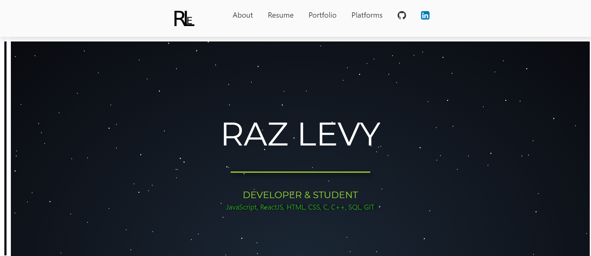

## Raz Levy's Portfolio WebApp
- I made this portfolio using ReactJS and CSS to improve my ReactJS skills, feel free to use the code or take part of codes.

### Image:

### Used Frameworks:
- react-scroll
- Fontawesome 4.7
- Bootstrap

### Installation:
- Use "npm install" to install related frameworks.

### License:
Feel free to use, edit or take parts of code.
